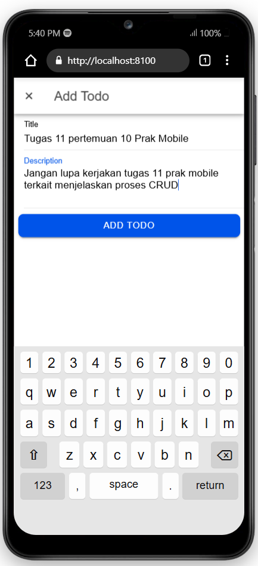
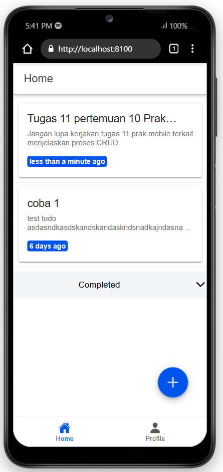
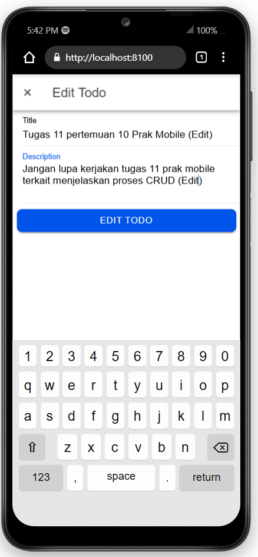
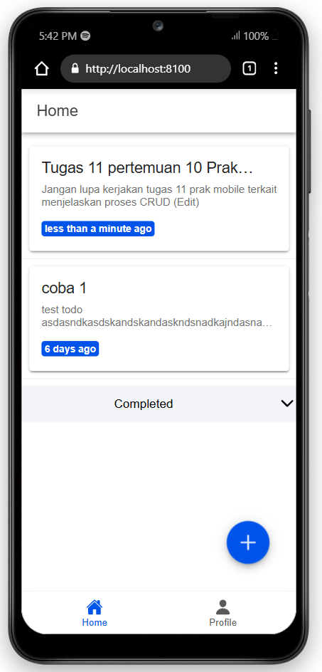
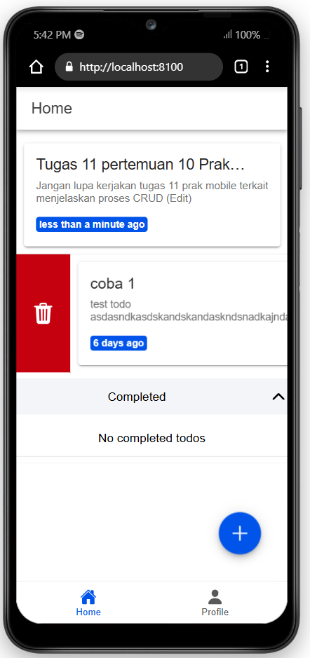
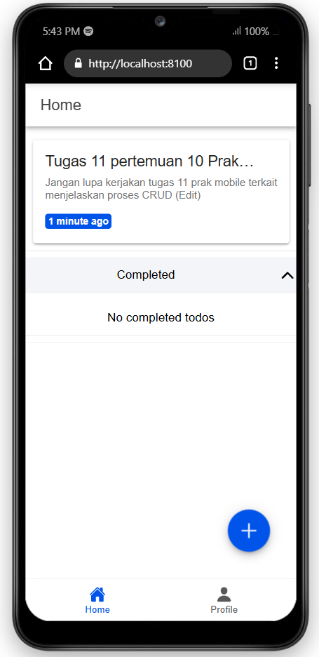
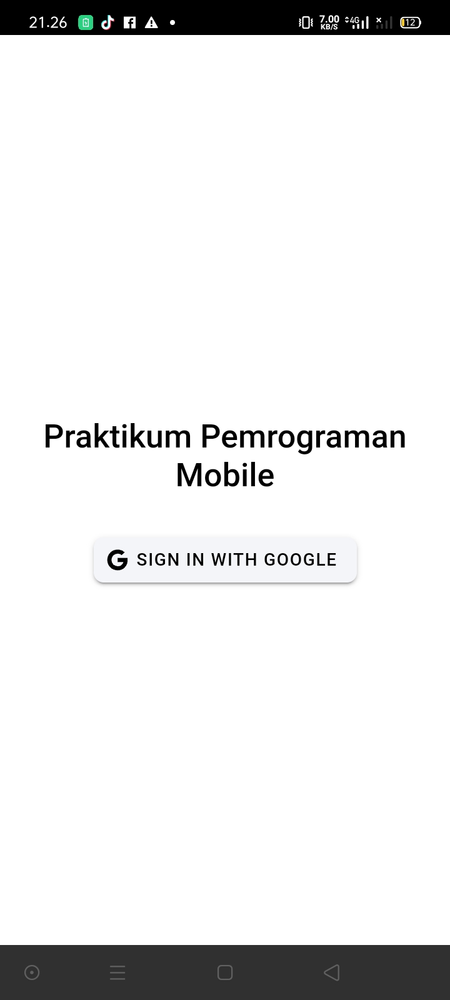

# Tugas 10 Pertemuan 11
IONIC Vue

Nama: Azzam Dicky Umar Widadi 
NIM: H1D022090  
Shift KRS: D
Shift Baru: F

## Screenshot
#### Create


#### Read


#### Update



#### Delete



## Penjelasan Program
### 1. Create
Fungsi `addTodo` menerima data `Todo` tanpa `id`, lalu menambahkan data ini ke koleksi Firestore menggunakan `addDoc`.<br>
Proses : <br>
    - Pengguna memasukkan data seperti `title` dan `description` melalui form atau modal.<br>
    - Validasi data, Periksa apakah data yang dimasukkan lengkap (tidak kosong).<br>
    - Buat objek yang berisi informasi `title`, `description`, serta tambahkan status default (`false`) dan timestamp (`createdAt`, `updatedAt`).<br>
    - Gunakan fungsi `addDoc` untuk menambahkan data ke koleksi Firestore.<br>
    - Notifikasi berhasil muncul<br>

```typescript
async addTodo(todo: Omit<Todo, 'id'>) {
        try {
            const todoRef = this.getTodoRef();
            const docRef = await addDoc(todoRef, {
                ...todo,
                status: false,
                createdAt: Timestamp.now(),
                updatedAt: Timestamp.now()
            });
            return docRef.id;
        } catch (error) {
            console.error('Error Tambah Todo:', error);
            throw error;
        }
    },
```

### 2. Read
Fungsi `getTodos` mengambil semua data dari koleksi menggunakan `getDocs`, kemudian mengubahnya menjadi array objek.<br>
Proses : <br>
    - Gunakan fungsi `getTodoRef` untuk mendapatkan referensi ke koleksi pengguna.<br>
    - Urutkan data berdasarkan `updatedAt` agar yang terbaru muncul di awal.<br>
    - Gunakan `getDocs` untuk mengambil semua dokumen yang sesuai dengan query.<br>
    - Data tampil di halaman.<br>

```typescript
async getTodos(): Promise<Todo[]> {
        try {
            const todoRef = this.getTodoRef();
            const q = query(todoRef, orderBy('updatedAt', 'desc'));
            const snapshot = await getDocs(q);
            return snapshot.docs.map((doc) => ({
                id: doc.id,
                ...doc.data()
            } as Todo));
        } catch (error) {
            console.error('Error Get Todos:', error);
            throw error;
        }
    },
```

### 3. Update
Fungsi `updateTodo` memperbarui data dokumen tertentu berdasarkan `id` menggunakan `updateDoc`.<br>
Proses : <br>
    - Pengguna memilih item tertentu dan klik icon edit.<br>
    - Form akan berisi dengan data lama(sudah ada).<br>
    - Perubahan dikirim ke firestore, `updateDoc` untuk memperbarui dokumen berdasarkan `id`.<br>
    - Notifikasi keberhasilan muncul<br>

```typescript
async updateTodo(id: string, todo: Partial<Todo>) {
        try {
            const todoRef = this.getTodoRef();
            const docRef = doc(todoRef, id);
            await updateDoc(docRef, {
                ...todo,
                updatedAt: Timestamp.now()
            });
        } catch (error) {
            console.error('Error Update Todo:', error);
            throw error;
        }
    },
```

### 4. Delete
Fungsi `deleteTodo` menghapus dokumen berdasarkan `id` menggunakan `deleteDoc`.<br>
Proses : <br>
    - Pengguna memilih item yang akan dihapus, melalui tombol delete.<br>
    - Mengirim perintah ke firestore dengan `deleteDoc` untuk menghapus dokumen berdasarkan `id`.<br>
    - Notifikasi keberhasilan muncul<br>

```typescript
async deleteTodo(id: string) {
        try {
            const todoRef = this.getTodoRef();
            const docRef = doc(todoRef, id);
            await deleteDoc(docRef);
        } catch (error) {
            console.error('Error Delete Todo:', error);
            throw error;
        }
    },
```

#### Cara Build APK
1. npm install -g @ionic/cli
2. npm install @capacitor/core @capacitor/cli
3. npx cap add android
4. ionic build --prod
5. npx cap copy
6. npx cap sync
7. npx cap open android

kemudian akan menginstall gradle, tunggu hingga selesai kemudian pilih menu Build > Build Bundle(s)/APK(s) > Build APK(s).<br>
setelah itu, pilih locate dan copy file app-debug.apk kirim ke ponsel untuk diinstall



# Tugas Pertemuan 10
IONIC

Nama: Azzam Dicky Umar Widadi 
NIM: H1D022090  
Shift KRS: D
Shift Baru: F

## Screenshot


## Penjelasan Program
### 1. Konfigurasi Firebase
Pada file `firebase.ts`, Firebase dikonfigurasi dengan detail seperti `apiKey`, `authDomain`, dan lainnya. Firebase Authentication diinisialisasi menggunakan:<br>
    - `getAuth`: Untuk mendapatkan instance autentikasi Firebase.<br>
    - `GoogleAuthProvider`: Penyedia autentikasi Google untuk integrasi login.<br>

```typescript
const auth = getAuth(firebase);
const googleProvider = new GoogleAuthProvider();
export { auth, googleProvider };
```

### 2. Autentikasi
Pada file `stores/auth.ts`, Pinia digunakan untuk mengelola status autentikasi:<br>
alur :<br>
1. State Management:<br>
    - `user`: Menyimpan data pengguna yang sedang login.<br>
    - `isAuth`: Mengecek apakah pengguna sudah login.<br>
2. Fungsi Login `loginWithGoogle`:<br>
    - `GoogleAuth.initialize`: Menginisialisasi Google Auth untuk Capacitor.<br>
    - `GoogleAuth.signIn`: Mengaktifkan login Google.<br>
    - `signInWithCredential`: Mengautentikasi token Google dengan Firebase.<br>
    - Setelah login berhasil, pengguna diarahkan ke halaman `/home`.<br>
3. Fungsi Logout:<br>
    - `signOut`: Logout dari Firebase dan GoogleAuth, menghapus status pengguna.
    - `onAuthStateChanged`: Memastikan status autentikasi pengguna tetap sinkron saat aplikasi dijalankan. <br>

```typescript
const loginWithGoogle = async () => {
    const googleUser = await GoogleAuth.signIn();
    const idToken = googleUser.authentication.idToken;
    const credential = GoogleAuthProvider.credential(idToken);
    const result = await signInWithCredential(auth, credential);
    user.value = result.user;
    router.push("/home");
};
```

### 3. Routing
Pada file `router/index.ts`, rute aplikasi dijaga dengan middleware yang memeriksa status autentikasi pengguna:<br>
alur :<br>
1. Proteksi Rute<br>
    - Halaman seperti `/home` dan `/profile` memerlukan status login.<br>
    - Middleware memeriksa properti `isAuth` sebelum mengizinkan akses.<br>
    - Jika pengguna belum login, mereka diarahkan ke `/login`.<br>

```typescript
router.beforeEach(async (to, from, next) => {
  const authStore = useAuthStore();

  if (authStore.user === null) {
    await new Promise<void>((resolve) => {
      const unsubscribe = onAuthStateChanged(auth, () => {
        resolve();
        unsubscribe();
      });
    });
  }

  if (to.path === '/login' && authStore.isAuth) {
    next('/home');
  } else if (to.meta.isAuth && !authStore.isAuth) {
    next('/login');
  } else {
    next();
  }
});
```

### 4. Login Page
Pada file LoginPage.vue, pengguna dapat login dengan menekan tombol Sign In with Google:<br>
    - Tombol memanggil fungsi `loginWithGoogle` dari store.<br>
    - Jika login berhasil, pengguna diarahkan ke `/home`.<br>

```vue
<ion-button @click="login" color="light">
  <ion-icon slot="start" :icon="logoGoogle"></ion-icon>
  <ion-label>Sign In with Google</ion-label>
</ion-button>
```
### 5. Menampilkan Profil Pengguna
Setelah login, data pengguna dapat diakses melalui properti `user` di store. Data ini meliputi:<br>
    - `user.displayName`: Nama pengguna.<br>
    - `user.email`: Email pengguna.<br>
    - `user.photoURL`: Foto profil pengguna.<br>

```vue
<template>
  <ion-content>
    <div v-if="authStore.user">
      
      <h2>{{ authStore.user.displayName }}</h2>
      <p>{{ authStore.user.email }}</p>
    </div>
    <ion-button @click="authStore.logout">Logout</ion-button>
  </ion-content>
</template>

<script setup>
import { useAuthStore } from '@/stores/auth';
const authStore = useAuthStore();
</script>
```

### 6. Foto pofile
untuk menampilkan profile pengguna ditambahkan kode berikut pada `ProfilePage.vue`

```vue
<div id="avatar-container">
    <ion-avatar>
         console.log('Image loaded successfully', userPhoto)"
        />
    </ion-avatar>
</div>
```

### Alur
1. Login <br>
Pengguna ➡️ Klik "Sign In with Google" ➡️ Google Sign-In ➡️ Firebase Authentication ➡️ Data disimpan di store.<br>
2. Proteksi Rute <br>
Pengguna mencoba akses halaman ➡️ Middleware router memeriksa status login ➡️ Akses diizinkan/ditolak.
3. Menampilkan Profil <br>
Halaman profil membaca data dari store ➡️ Data ditampilkan.