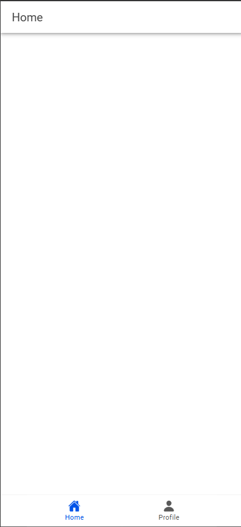

# Tugas Pertemuan 10
IONIC

Nama: Azzam Dicky Umar Widadi 
NIM: H1D022090  
Shift KRS: D
Shift Baru: F

## Screenshot





## Penjelasan Program
### 1. Konfigurasi Firebase
Pada file `firebase.ts`, Firebase dikonfigurasi dengan detail seperti `apiKey`, `authDomain`, dan lainnya. Firebase Authentication diinisialisasi menggunakan:<br>
    - `getAuth`: Untuk mendapatkan instance autentikasi Firebase.<br>
    - `GoogleAuthProvider`: Penyedia autentikasi Google untuk integrasi login.<br>

```typescript
const auth = getAuth(firebase);
const googleProvider = new GoogleAuthProvider();
export { auth, googleProvider };
```

### 2. Autentikasi
Pada file `stores/auth.ts`, Pinia digunakan untuk mengelola status autentikasi:<br>
alur :<br>
1. State Management:<br>
    - `user`: Menyimpan data pengguna yang sedang login.<br>
    - `isAuth`: Mengecek apakah pengguna sudah login.<br>
2. Fungsi Login `loginWithGoogle`:<br>
    - `GoogleAuth.initialize`: Menginisialisasi Google Auth untuk Capacitor.<br>
    - `GoogleAuth.signIn`: Mengaktifkan login Google.<br>
    - `signInWithCredential`: Mengautentikasi token Google dengan Firebase.<br>
    - Setelah login berhasil, pengguna diarahkan ke halaman `/home`.<br>
3. Fungsi Logout:<br>
    - `signOut`: Logout dari Firebase dan GoogleAuth, menghapus status pengguna.
    - `onAuthStateChanged`: Memastikan status autentikasi pengguna tetap sinkron saat aplikasi dijalankan. <br>

```typescript
const loginWithGoogle = async () => {
    const googleUser = await GoogleAuth.signIn();
    const idToken = googleUser.authentication.idToken;
    const credential = GoogleAuthProvider.credential(idToken);
    const result = await signInWithCredential(auth, credential);
    user.value = result.user;
    router.push("/home");
};
```

### 3. Routing
Pada file `router/index.ts`, rute aplikasi dijaga dengan middleware yang memeriksa status autentikasi pengguna:<br>
alur :<br>
1. Proteksi Rute<br>
    - Halaman seperti `/home` dan `/profile` memerlukan status login.<br>
    - Middleware memeriksa properti `isAuth` sebelum mengizinkan akses.<br>
    - Jika pengguna belum login, mereka diarahkan ke `/login`.<br>

```typescript
router.beforeEach(async (to, from, next) => {
  const authStore = useAuthStore();

  if (authStore.user === null) {
    await new Promise<void>((resolve) => {
      const unsubscribe = onAuthStateChanged(auth, () => {
        resolve();
        unsubscribe();
      });
    });
  }

  if (to.path === '/login' && authStore.isAuth) {
    next('/home');
  } else if (to.meta.isAuth && !authStore.isAuth) {
    next('/login');
  } else {
    next();
  }
});
```

### 4. Login Page
Pada file LoginPage.vue, pengguna dapat login dengan menekan tombol Sign In with Google:<br>
    - Tombol memanggil fungsi `loginWithGoogle` dari store.<br>
    - Jika login berhasil, pengguna diarahkan ke `/home`.<br>

```vue
<ion-button @click="login" color="light">
  <ion-icon slot="start" :icon="logoGoogle"></ion-icon>
  <ion-label>Sign In with Google</ion-label>
</ion-button>
```
### 5. Menampilkan Profil Pengguna
Setelah login, data pengguna dapat diakses melalui properti `user` di store. Data ini meliputi:<br>
    - `user.displayName`: Nama pengguna.<br>
    - `user.email`: Email pengguna.<br>
    - `user.photoURL`: Foto profil pengguna.<br>

```vue
<template>
  <ion-content>
    <div v-if="authStore.user">
      
      <h2>{{ authStore.user.displayName }}</h2>
      <p>{{ authStore.user.email }}</p>
    </div>
    <ion-button @click="authStore.logout">Logout</ion-button>
  </ion-content>
</template>

<script setup>
import { useAuthStore } from '@/stores/auth';
const authStore = useAuthStore();
</script>
```

### Alur
1. Login <br>
Pengguna ➡️ Klik "Sign In with Google" ➡️ Google Sign-In ➡️ Firebase Authentication ➡️ Data disimpan di store.<br>
2. Proteksi Rute <br>
Pengguna mencoba akses halaman ➡️ Middleware router memeriksa status login ➡️ Akses diizinkan/ditolak.
3. Menampilkan Profil <br>
Halaman profil membaca data dari store ➡️ Data ditampilkan.